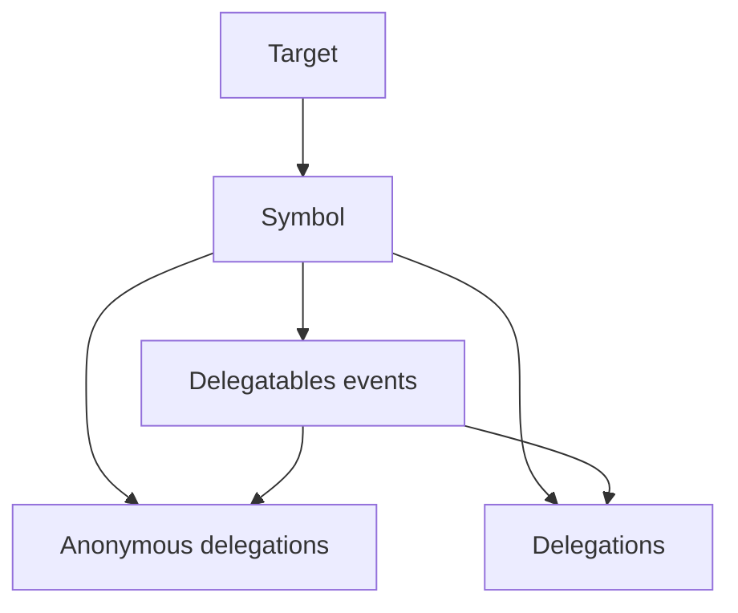

# Delegado

A event delegation library that leverages `WeakMap` and `FinalizationRegistry` APIs, where every event is tied to a Symbol whose value is stored in a `WeakMap` wherein the keys are the `target` ("the sender") of all functions. Without the sender, there are no messages, hence no events to be dispatched, so we clear them all.

## Details

When the client calls "attachEvents*", the target **must** be supplied. A `symbol` is created and assigned to this target. The given events are assigned to the newly created `symbol`, so that when the target is garbage collected, the clean-up depends on the `symbol` not the `target`.